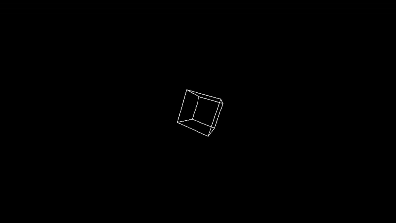

# SFML-3D-Cube-Demo

A C++ project that renders a 3D rotating cube using SFML graphics library. The project demonstrates basic 3D mathematics including rotation matrices and perspective projection.


## 📚 Tutorial & Learning Resources

### 🎯 **Step-by-Step Guide**
For a comprehensive tutorial on building this project from scratch, check out our detailed guide:

**[🚀 3D Engine Fundamentals with C++ ](https://medium.com/@hasinthainduwara/3d-engine-fundamentals-with-c-cdb5edcdaedf)**

**[🚀From Math to Code: Rotation Matrices with C++ ](https://medium.com/@hasinthainduwara/from-math-to-code-rotation-matrices-with-c-47d1fd8f94a9)**


*Learn how to:*
- Set up SFML with CMake
- Implement 3D rotation matrices
- Create perspective projection
- Build a complete 3D graphics application

### 📖 **Additional Learning Materials**
- **SFML Documentation**: [Official SFML Guide](https://www.sfml-dev.org/learn.php)
- **CMake Tutorial**: [CMake Getting Started](https://cmake.org/cmake/help/latest/guide/tutorial/)
- **3D Graphics Fundamentals**: Understanding rotation matrices and projection

## Project Overview

This project creates a real-time 3D visualization of a wireframe cube that rotates around multiple axes. It's built using:
- **CMake** for build system management
- **SFML 3.x** for graphics rendering
- **C++17** for modern C++ features
- **Visual Studio 2022** or **Ninja** build tools

## Prerequisites

### Required Software
- **CMake** 3.8 or higher
- **C++ Compiler** supporting C++17:
  - Visual Studio 2019/2022 (Windows)
  - GCC 7+ (Linux)
  - Clang 5+ (macOS)
- **SFML 3.x** (included in project)

### System Requirements
- Windows 10/11 (primary target)
- 4GB RAM minimum
- DirectX 11 compatible graphics card

## Project Structure

```
CMakeProject1/
├── CMakeLists.txt              # Main CMake configuration
├── CMakePresets.json           # Build presets for different configurations
├── CMakeProject1/
│   ├── CMakeLists.txt         # Project-specific CMake configuration
│   ├── CMakeProject1.cpp      # Main source code
│   └── CMakeProject1.h        # Header file
├── SFML/                      # SFML library (pre-built)
│   ├── include/               # SFML headers
│   ├── lib/                   # SFML libraries
│   └── bin/                   # SFML runtime DLLs
├── build/                     # Build output (Visual Studio)
└── out/                       # Build output (Ninja)
```

## Building the Project

### Method 1: Using CMake Presets (Recommended)

#### For Visual Studio 2022:
```bash
# Configure and build using Visual Studio generator
cmake --preset windows
cmake --build --preset windows-debug
```

#### For Ninja (faster builds):
```bash
# Configure using Ninja generator
cmake --preset x64-debug

# Build the project
cmake --build out/build/x64-debug
```

### Method 2: Manual CMake Configuration

#### Step 1: Create Build Directory
```bash
mkdir build
cd build
```

#### Step 2: Configure with CMake
```bash
# For Visual Studio 2022
cmake .. -G "Visual Studio 17 2022" -A x64

# For Ninja (requires Ninja to be installed)
cmake .. -G "Ninja"
```

#### Step 3: Build the Project
```bash
# For Visual Studio
cmake --build . --config Debug

# For Ninja
cmake --build .
```

### Method 3: Using Visual Studio IDE

1. Open the generated `CMakeProject1.sln` file in Visual Studio
2. Select your desired build configuration (Debug/Release)
3. Build the solution (Ctrl+Shift+B)

## Running the Application

After successful build, the executable will be located at:
- **Visual Studio**: `build/CMakeProject1/Debug/CMakeProject1.exe`
- **Ninja**: `out/build/x64-debug/CMakeProject1/CMakeProject1.exe`

### Running from Command Line
```bash
# Navigate to the executable directory
cd build/CMakeProject1/Debug

# Run the application
./CMakeProject1.exe
```

### Running from Visual Studio
- Set `CMakeProject1` as the startup project
- Press F5 to run with debugging or Ctrl+F5 to run without debugging

## Features

- **3D Wireframe Cube**: Renders a cube using line primitives
- **Real-time Rotation**: Smooth rotation around X and Y axes
- **Perspective Projection**: 3D to 2D projection with depth
- **SFML Graphics**: Hardware-accelerated rendering
- **Cross-platform**: Compatible with Windows, Linux, and macOS

## Configuration Options

### Build Types
- **Debug**: Includes debug symbols and assertions
- **Release**: Optimized for performance

### Architecture
- **x64**: 64-bit builds (recommended)
- **x86**: 32-bit builds (legacy support)

### Rotation Speed
The rotation speed can be adjusted in the source code:
```cpp
float rotationSpeed = 0.05f;  // Adjust this value
```

## Troubleshooting

### Common Build Issues

#### SFML DLL Errors
If you get "SFML DLL not found" errors:
1. Ensure SFML DLLs are copied to the executable directory
2. Check that the `SFML/bin` directory contains all required DLLs
3. Verify the CMake configuration is copying DLLs correctly

#### Compiler Version Issues
If you get C++17 compatibility errors:
1. Ensure your compiler supports C++17
2. Check that CMake is using the correct compiler
3. Verify `CMAKE_CXX_STANDARD` is set to 17

#### CMake Configuration Errors
If CMake fails to configure:
1. Ensure CMake version is 3.8 or higher
2. Check that all required dependencies are available
3. Verify the SFML paths in `CMakeProject1/CMakeLists.txt`

### Debugging Tips

1. **Use Debug Build**: Always test with Debug builds first
2. **Check Console Output**: Look for error messages during build
3. **Verify Paths**: Ensure SFML paths are correct for your system
4. **Clean Build**: Try deleting build directories and rebuilding

## Development

### Adding New Features
1. Modify `CMakeProject1.cpp` for new functionality
2. Update `CMakeProject1.h` if adding new classes/functions
3. Rebuild the project to test changes

### Code Structure
- **Vec3**: 3D vector structure for coordinates
- **Rotation Functions**: `rotateX()`, `rotateY()` for 3D transformations
- **Projection**: `project()` function for 3D to 2D conversion
- **Main Loop**: Game loop with rendering and rotation updates

## Dependencies

### SFML Libraries Used
- **sfml-graphics**: 2D graphics rendering
- **sfml-window**: Window management and events
- **sfml-system**: Core system functionality

### External Libraries
- **FLAC**: Audio codec support
- **FreeType**: Font rendering
- **Vorbis**: Audio codec support

## License

This project uses SFML which is licensed under the zlib/png license. See the SFML documentation for more details.

## Contributing

1. Fork the repository
2. Create a feature branch
3. Make your changes
4. Test thoroughly
5. Submit a pull request

## Support

For issues and questions:
1. Check the troubleshooting section above
2. Review CMake and SFML documentation
3. Check the build output for specific error messages
4. Ensure all prerequisites are properly installed

## Version History

- **v1.0**: Initial release with 3D rotating cube
- Basic rotation around X and Y axes
- SFML 3.x compatibility
- CMake build system integration
